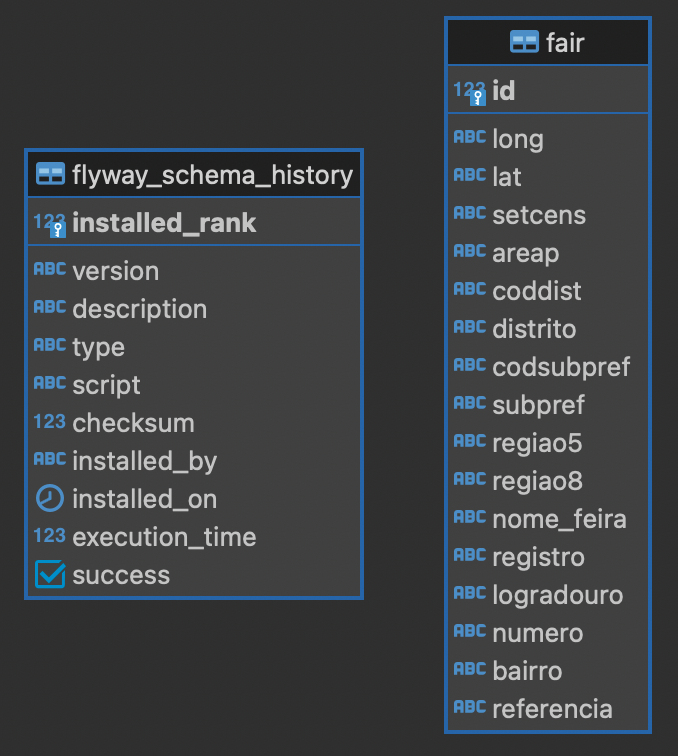

# Fair API — API de feiras livres de São Paulo

Esta API foi desenvolvida em Java com o framework Spring Boot para expor os dados de feiras na cidade de São Paulo.

Estes dados estão disponíveis para download no [site da Prefeitura de São Paulo](http://www.prefeitura.sp.gov.br/cidade/secretarias/upload/chamadas/feiras_livres_1429113213.zip).

Para essa aplicação, os dados presentes em `DEINFO_AB_FEIRASLIVRES_2014.csv` foram utilizados como base para construção da base de dados.
Os dados presentes em `DEINFO_AB_FEIRASLIVRES_2014_Variаveis.csv` serviram como interpretação dos dados da tabela anterior.

## Dependências

O projeto foi desenvolvido com Java 15 e Spring Boot 2.x.x.

#### Principais dependências utilizadas:

- Spring Boot Starter: para dependências do Spring Boot
- Spock framework: para execução dos testes
- Flyway: para migração do banco de dados
- Lombok: para facilidade ao criar métodos básicos e construir objetos
- Jackson: para manipulação de json
- Springdoc Openapi: para documentação dos endpoints
- Swagger-ui: para exibição da documentação
- Sonar Qube: um linter para um código limpo e seguindo melhores práticas
- Hibernate: para melhor acesso e manipulação da camada de dados

#### Bibliotecas para testes:
- Spock Framework com Groovy
- Jacoco para cobertura de testes

## Pré requisito
- Ter o Docker instalado

## Instalação e configuração

1) Clone o repositório

```shell
git clone https://github.com/pablo-bochi/fair-api.git
cd fair-api
```

2) Realize o login no Docker CLI (será pedido username e password, que são os mesmos utilizados para acessar o [docker-hub](https://hub.docker.com/)):

```shell
docker login
```

3) Configure as variáveis de ambiente:

Para o funcionamento correto da aplicação é necessária a configuração de algumas variáveis de ambiente.
Para isto, basta editar o arquivo `.env` com os valores das variáveis pré-preenchidas no arquivo.

As variáveis essenciais para o funcionamento da aplicação são:

4) Execute o script `run.sh`:

```shell
source run_app.sh
```

#### Testes unitários e de integração

Para rodar os testes unitários e de integração desenvolvidos nessa aplicação, basta executar o script `run_tests.sh`:

```shell
source run_tests.sh
```

Após a execução dos testes, o relatório de cobertura de testes pode ser visualizado no diretório `test-report`. Basta abrir o arquivo `index.html` em um navegador.

## Modelagem do banco de dados

A estrutura do banco de dados foi definida a partir do arquivo `DEINFO_AB_FEIRASLIVRES_2014_Variáveis.csv`.
Após análise, foi criada apenas uma tabela `fair`, contendo todos os dados apresentados no arquivo citado acima.

A partir dos dados analisados, foi definida a seguinte estrutura:



Os nomes utilizados nas colunas, bem como o tamanho definido para cada uma, foi definido baseado nas variáveis descritas no arquivo.
No diagrama podemos visualizar duas tabelas: `flyway_schema_history` e `fair`. A primeira é utilizada pelo Flyway para controle dos arquivos de migração do banco de dados, a segunda representa a entidade Feira.

## Documentação da API

A API possui uma documentação que pode ser acessada e testada através da Swagger-ui, uma vez que a aplicação esteja sendo executada.

Para acessar as definições geradas pelo Openapi, basta utilizar este [endereço](http://localhost:8062/fair-api-docs).

A Swagger-ui pode ser acessada através deste [link](http://localhost:8062/fair-api-swagger).

## Referência da API

Para testar as APIs expostas na aplicação, podemos utilizar o [Postman](https://www.postman.com/). A coleção com as APIs configuradas pode ser acessada em `postman-collection/fair-api.postman_collection.json`.

### POST

Criação de uma nova feira.
O corpo da requisição consiste todos os campos presentes na tabela `fair` do banco de dados mostrada em [Modelagem do banco de dados](#modelagem-do-banco-de-dados), com exceção do campo `id`.

```yaml
Caminho: /fair/api
Método: POST
Corpo da requisição:
{
    "long": "-46660663",
    "lat": "-23490605",
    "setcens": "355030821000044",
    "areap": "3550308005062",
    "coddist": "21",
    "distrito": "CASA VERDE",
    "codsubpref": "4",
    "subpref": "CASA VERDE-CACHOEIRINHA",
    "regiao5": "Norte",
    "regiao8": "Norte 1",
    "nome_feira": "CARMEM",
    "registro": "6024-0",
    "logradouro": "RUA CESAR PENA RAMOS",
    "numero": "592",
    "bairro": "CASA VERDE",
    "referencia": "ENTRE BALDOVENETI E CAPANEO"
}

Corpo da resposta:
{
    "long": "-46660663",
    "lat": "-23490605",
    "setcens": "355030821000044",
    "areap": "3550308005062",
    "coddist": "21",
    "distrito": "CASA VERDE",
    "codsubpref": "4",
    "subpref": "CASA VERDE-CACHOEIRINHA",
    "regiao5": "Norte",
    "regiao8": "Norte 1",
    "nome_feira": "CARMEM",
    "registro": "6024-0",
    "logradouro": "RUA CESAR PENA RAMOS",
    "numero": "592",
    "bairro": "CASA VERDE",
    "referencia": "ENTRE BALDOVENETI E CAPANEO"
}
HttpStatus:
  Criado: 201
  Erro no servidor: 500
```

#### Exemplo em curl
````shell
curl --location --request POST 'http://localhost:8062/fair/api' \
--header 'Content-Type: application/json' \
--data-raw '{
"long": "-46660663",
"lat": "-23490605",
"setcens": "355030821000044",
"areap": "3550308005062",
"coddist": "21",
"distrito": "CASA VERDE",
"codsubpref": "4",
"subpref": "CASA VERDE-CACHOEIRINHA",
"regiao5": "Norte",
"regiao8": "Norte 1",
"nome_feira": "CARMEM",
"registro": "6024-0",
"logradouro": "RUA CESAR PENA RAMOS",
"numero": "592",
"bairro": "CASA VERDE",
"referencia": "ENTRE BALDOVENETI E CAPANEO"
}'
````

### GET 

Busca página de feiras por filtro.

Este endpoint aceita os seguintes campos como filtro via query string:

- `district`: Distrito pelo qual se deseja filtrar as feiras
- `region5`: Nome da região conforme divisão do município em 5 áreas
- `fairName`: Nome da feira
- `neighbourhood`: Bairro da feira

```yaml
Caminho: /fair/api
Método: GET
Parâmetros: page (default 0), size (default 20), district, region5, fairName, neighbourhood

Corpo da resposta:
{
    "content": [
      {
        "long": "-46660663",
        "lat": "-23490605",
        "setcens": "355030821000044",
        "areap": "3550308005062",
        "coddist": "21",
        "distrito": "CASA VERDE",
        "codsubpref": "4",
        "subpref": "CASA VERDE-CACHOEIRINHA",
        "regiao5": "Norte",
        "regiao8": "Norte 1",
        "nome_feira": "CARMEM",
        "registro": "6024-0",
        "logradouro": "RUA CESAR PENA RAMOS",
        "numero": "592",
        "bairro": "CASA VERDE",
        "referencia": "ENTRE BALDOVENETI E CAPANEO"
      }
    ],
    "pageable": {
      "sort": {
        "empty": true,
        "sorted": false,
        "unsorted": true
      },
      "offset": 0,
      "pageNumber": 0,
      "pageSize": 20,
      "paged": true,
      "unpaged": false
    },
    "totalPages": 1,
    "totalElements": 1,
    "last": true,
    "size": 20,
    "number": 0,
    "sort": {
      "empty": true,
      "sorted": false,
      "unsorted": true
    },
    "numberOfElements": 1,
    "first": true,
    "empty": false
}

HttpStatus:
  Ok: 200
  Erro no servidor: 500
```

#### Exemplo em curl
````shell
curl --location --request GET 'http://localhost:8062/fair/api?district=CARANDIRU&region5=VL MADA&fairName=DEOLA FRESCA&neighbourhood=VL PRUDENTE&page=1&size=10' \
````

### GET 

Busca uma feira pelo nome.

```yaml
Caminho: /fair/api/{fairName}
Método: GET
Parâmetros: fairName - nome da feira

Corpo da resposta:
{
    "long": "-46660663",
    "lat": "-23490605",
    "setcens": "355030821000044",
    "areap": "3550308005062",
    "coddist": "21",
    "distrito": "CASA VERDE",
    "codsubpref": "4",
    "subpref": "CASA VERDE-CACHOEIRINHA",
    "regiao5": "Norte",
    "regiao8": "Norte 1",
    "nome_feira": "CARMEM",
    "registro": "6024-0",
    "logradouro": "RUA CESAR PENA RAMOS",
    "numero": "592",
    "bairro": "CASA VERDE",
    "referencia": "ENTRE BALDOVENETI E CAPANEO"
}
HttpStatus:
  Ok: 200
  Feira não encontrada: 404
  Erro no servidor: 500
```

#### Exemplo em curl
````shell
curl --location --request GET 'http://localhost:8062/fair/api/CARMEM' \
````

### PUT 

Atualizar uma feira a partir do seu registro.

Qualquer campo da feira pode ser atualizado, com exeção do `id` e do `registro`.

```yaml
Caminho: /fair/api/{registerCode}
Método: PUT
Parâmetros: registerCode - registro
Corpo da requisição:
{
    "long": "-46660663",
    "lat": "-23490605",
    "setcens": "6245146256367",
    "areap": "453421123",
    "coddist": "21",
    "distrito": "CASA VERDE",
    "codsubpref": "4",
    "subpref": "CASA VERDE-CACHOEIRINHA",
    "regiao5": "Norte",
    "regiao8": "Norte 1",
    "nome_feira": "PAULA",
    "logradouro": "RUA CESAR PENA RAMOS",
    "numero": "592",
    "bairro": "CASA VERDE",
    "referencia": "ENTRE BALDOVENETI E CAPANEO"
}

Corpo da resposta:
{
    "long": "-46660663",
    "lat": "-23490605",
    "setcens": "6245146256367",
    "areap": "453421123",
    "coddist": "21",
    "distrito": "CASA VERDE",
    "codsubpref": "4",
    "subpref": "CASA VERDE-CACHOEIRINHA",
    "regiao5": "Norte",
    "regiao8": "Norte 1",
    "nome_feira": "PAULA",
    "registro": "6024-0",
    "logradouro": "RUA CESAR PENA RAMOS",
    "numero": "592",
    "bairro": "CASA VERDE",
    "referencia": "ENTRE BALDOVENETI E CAPANEO"
}
HttpStatus:
  Ok: 200
  Feira não encontrada: 404
  Erro no servidor: 500
```

#### Exemplo em curl
````shell
curl --location --request PUT 'http://localhost:8062/fair/api/6024-0' \
--header 'Content-Type: application/json' \
--data-raw '{
    "long": "-46660663",
    "lat": "-23490605",
    "setcens": "6245146256367",
    "areap": "453421123",
    "coddist": "21",
    "distrito": "CASA VERDE",
    "codsubpref": "4",
    "subpref": "CASA VERDE-CACHOEIRINHA",
    "regiao5": "Norte",
    "regiao8": "Norte 1",
    "nome_feira": "PAULA",
    "logradouro": "RUA CESAR PENA RAMOS",
    "numero": "592",
    "bairro": "CASA VERDE",
    "referencia": "ENTRE BALDOVENETI E CAPANEO"
}'
````

### PATCH

Atualiza apenas um campo de uma feira, a partir do seu registro.
O corpo da requisição aceita um campo `field`, onde é colocado o nome do campo que se deseja atualizar, e o campo `value`, onde é colocado o novo valor do campo.

```yaml
Caminho: /fair/api/{registerCode}
Método: PATCH
Parâmetros: registerCode - registro
Corpo da requisição:
{
    "field": "nome_feira",
    "value": "PAULA"
}

Corpo da resposta:
{
    "long": "-46660663",
    "lat": "-23490605",
    "setcens": "6245146256367",
    "areap": "453421123",
    "coddist": "21",
    "distrito": "CASA VERDE",
    "codsubpref": "4",
    "subpref": "CASA VERDE-CACHOEIRINHA",
    "regiao5": "Norte",
    "regiao8": "Norte 1",
    "nome_feira": "PAULA",
    "registro": "6024-0",
    "logradouro": "RUA CESAR PENA RAMOS",
    "numero": "592",
    "bairro": "CASA VERDE",
    "referencia": "ENTRE BALDOVENETI E CAPANEO"
}
HttpStatus:
  Ok: 200
  Feira não encontrada: 404
  Erro no servidor: 500
```

#### Exemplo em curl
````shell
curl --location --request PATCH 'http://localhost:8062/fair/api/6024-0' \
--header 'Content-Type: application/json' \
--data-raw '{
    "field": "nome_feira",
    "value": "partially"
}'
````

### DELETE

Deleta uma feira do banco de dados.

```yaml
Caminho: /fair/api/{registerCode}
Método: DELETE
Parâmetros: registerCode - registro

HttpStatus:
  Ok: 200
  Feira não encontrada: 404
  Erro no servidor: 500
```

#### Exemplo em curl
````shell
curl --location --request DELETE 'http://localhost:8062/fair/api/6024-0' \
--data-raw ''
````
